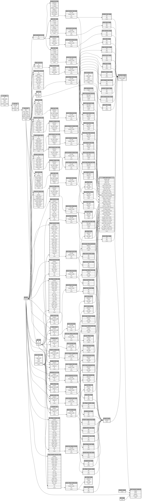

```
# AUTOGENERATED BY ECOSCOPE-WORKFLOWS; see fingerprint in README.md for details

```

```yaml
# fingerprint:
artifacts_sha256_basic: 45c216768e0900901fa4994a2a1357f961597be0e6cbff9aff2a00d4b981a460
artifacts_sha256_strict: d360adb64d5cf2054de86d6aa213aebd86a2441375469741f467c6fa8ecaad81
installed_requirements:
- channel: https://repo.prefix.dev/ecoscope-workflows/
  name: ecoscope-workflows-core
  version: {version: ==0.22.18}
- channel: https://repo.prefix.dev/ecoscope-workflows/
  name: ecoscope-workflows-ext-ecoscope
  version: {version: ==0.22.18}
- channel: https://repo.prefix.dev/ecoscope-workflows-custom/
  name: ecoscope-workflows-ext-custom
  version: {version: ==0.0.28}
- channel: https://repo.prefix.dev/ecoscope-workflows-custom/
  name: ecoscope-workflows-ext-ste
  version: {version: ==0.0.18}
- channel: https://repo.prefix.dev/ecoscope-workflows-custom/
  name: ecoscope-workflows-ext-bahari-hai
  version: {version: ==0.0.17}
- channel: conda-forge
  name: pandas
  version: {version: ==2.3.3}
- channel: conda-forge
  name: pandera
  version: {version: ==0.31.1}
- channel: conda-forge
  name: geopandas
  version: {version: ==1.1.3}
- channel: conda-forge
  name: fiona
  version: {version: ==1.10.1}
params_sha256: d875bb2a991bf2693edb9f1f030c610edba7fdece2cfa73d693ecebf00855f4f
spec_sha256: 92d3349e74b1eeaf4b993918396d0a39b1b33c08e245d293fa11f43b0cf6b010

```

# ecoscope-workflows-bh-antipoaching-workflow


